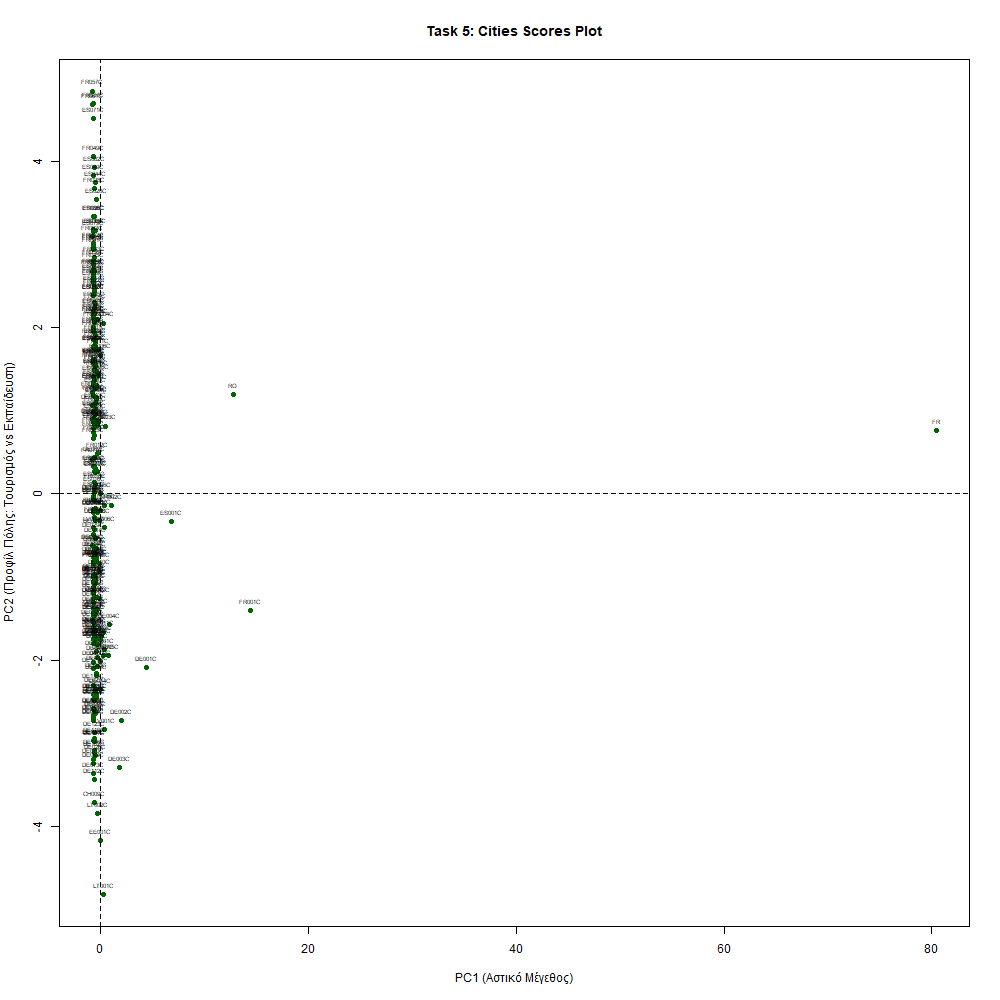
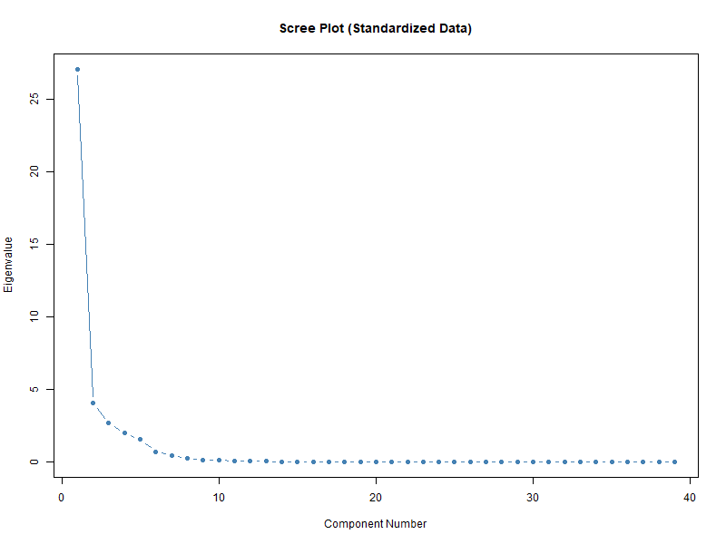

# Principal-Component-Analysis-R
Principal Component Analysis (PCA) on  Eurostat - Multivariate Statistical Analysis course at NKUA.
# European Retail Market Entry: PCA Clustering

This repository contains the code and documentation for a Principal Component Analysis (PCA) project, designed to identify the most attractive European cities for retail market expansion.

## 📂 Repository Structure

* **`pca_retail_analysis.R`**: The complete R script containing the data fetching, cleaning, Exploratory Data Analysis (EDA), and PCA modeling.
* **`assignment_instructions.pdf`**: The original business case study and assignment prompt.
* **`README.md`**: Project overview and results (this file).

## 🎯 Project Overview
A national retail company needs to select European cities for expansion. Using real-world data dynamically fetched from the **Eurostat API** (year 2018), this project applies PCA to reduce highly correlated urban indicators (population, unemployment, education, tourism) into actionable business insights.

## 🛠️ Tools & Technologies Used
* **Language:** R
* **Libraries:** `tidyverse`, `eurostat`, `janitor`, `psych`, `MASS`
* **Techniques:** Data Wrangling, Correlation & Covariance Analysis, Outlier Detection (Parallel Coordinates), PCA (Standardized & Unstandardized).

## 💡 Key Findings
1. **PC1 (Urban Scale):** Highlights the massive gap between metropolises (e.g., Paris, Berlin) and regional cities. 
2. **PC2 (Economic Profile):** Successfully polarizes Northern/Central European cities (driven by education and industrial stability) against Southern European cities (driven by tourism and seasonal employment).

## 📈 Visualizations

**City Clustering based on PC1 & PC2**

**Scree Plot for Component Selection**

